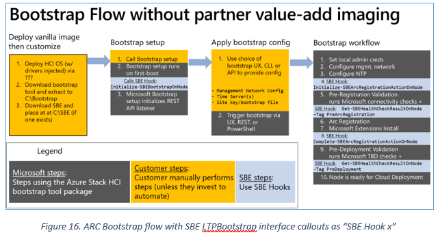
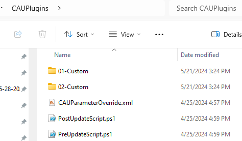

This troubleshooting guide will assist engineers with the basics of troubleshooting for SBE during bootstrap, deployment, and update.

# Introduction
Starting with Azure Stack HCI 23H2, HCI introduced the Lifecycle Manager (LCM) to orchestrate deployment and updates of the full solution using a **solution update** composed of the following components to implement a recipe to consistently deploy and update the solution:
* [Solution Builder Extension (SBE)](https://learn.microsoft.com/en-us/azure-stack/hci/update/solution-builder-extension) – A special type of solution extension provided by the server hardware vendor or system integrator (aka the Solution Builder) to provide updates for firmware, drivers, and other Hardware vendor specific tools.  See https://learn.microsoft.com/en-us/azure-stack/hci/update/solution-builder-extension for details.
* Platform Updates – OS and Security Updates
* Services Updates – Agents and services updates including LCM component updates

For general details on how solution extensions fits in with the other components as part of solution updates, see [About Updates 23H2](
https://learn.microsoft.com/en-us/azure-stack/hci/update/about-updates-23h2#whats-in-the-update-package) for details.

## SBE Related Term Definitions
* **Solution Extension** - A package consisting of 2 XML files (manifest and metadata) and a zip payload file. Used to provide constent way for partners to extend the HCI solution.
* **Solution Extension Discovery Manifest XML** - A signed multi-entry manifest that describes each partner solution extension release to date.  Used by LCM to establish trust for the zip file (XML is signed and has packageHash for zip file) and applicability rules used to discover which extension is a match for a specific model system and a specific solution update version.
* **Solution Extension metadata XML** - A signed metadata file that tracks expected contents of the zip file including a software BOM. Used to perform file integrity checks after extension zip file is expanded.
* **Solution Extension ZIP** - The zip file containing the extension content from the partner. See Solution Extension Zip Contents section below.
* **LCM** - The "Orchestrator" or Lifecycle Manager that orchestrates extension installation and updates as well as performs solution extension discovery to assure the correct extensions are included in deploymentents and updates.
* **CAU** - [Cluster Aware Updating or CAU](https://learn.microsoft.com/en-us/windows-server/failover-clustering/cluster-aware-updating) is leveraged by solution extensions to perform rolling updates using hardware vendor provided **CAU plugins** in the update use case; however, for deployment CAU is only used to perform a scan to determine if an update is needed (without actually performing the update).
* **WDAC Policy** - It is mandatory for solution extensions to contain the extension publisher's supplemental Windows Defender Application Control (WDAC) policy. This is the mechanism by which the content within the extension is allowed to execute. Gaps in the supplemental policy may result in extension operations being blocked by WDAC.

# Scoping Questions
When troubleshooting issues with a solution extension the following questions may be helpful to better understand the situation or identify common issues.

* Who is the system manufacturer and publisher of the solution extension?
* What is server model (solution builder extensions only supports specific models defined by partner)?
* Which solution version is being deployed/updated?
* Is your issue with bootstrap, pre-deployment (e.g. environment validation), cloud deployment, or update?
* If for deployment, which solution builder extension version and family version is staged at `C:\SBE\*.zip`
* If for update
  * What version of SBE is currently installed (per `Get-SolutionUpdateEnvironment`)?
  * What type of update is being installed? Does `Get-SolutionUpdate` list the `PackageType` as "SBE" (a "SBE-only" update) or "Solution" (a Platform + Services + SBE) update?
See this [discovery doc](https://learn.microsoft.com/en-us/azure-stack/hci/update/solution-builder-extension#discover-solution-builder-extension-updates-via-powershell) for how to tell which.
* How were the solution extension files obtained (e.g. preloaded by partner vs downloaded and placed by customer)?
* What InterfaceType task failed in the action plan?
  * If it starts with **SBEPartner** it likely failed executing partner code or installing partner files.
  * If it contains **CAU** it may still be partner code, but it may be need to Microsoft support assistance for deeper triage if the guidance is in this document is insufficient.
  * Other interfaces are less likely to be an issue caused by the solution extension and the [known issues](https://learn.microsoft.com/en-us/azure-stack/hci/release-information-23h2) for solution update version that is installed (or being installed) should be consulted.
 
# Getting information on solution extension failures
Solution extensions are directly integrated into the LCM Orchestration processes for deployment and update and thus the top level progress details can viewed direclty in the portal and PowerShell. This means that the first pass analysis for solution extension issues can be obtained using 
## Standardized solution builder extension logs
Solution extensions always create *.etl based log files at `C:\Observability\OEMDiagnostics` on the server that is currently executing the LCM Orchestrator (which will rotate based on node reboots).  ETL logs can be converted to text files using the `Get-ASEvent` cmdlet which is always installed on the 1st server in the cluster or with other utilities such as [WPA](https://learn.microsoft.com/en-us/windows-hardware/test/wpt/opening-and-analyzing-etl-files-in-wpa).  If using Get-ASEvent to view the logs, copy the logs to a location accessible on the 1st node and use syntax similar to the following if the file had been copied to c:\temp:
```
Get-ASEvent -Path c:\temp\example.etl > example.txt
notepad.exe example.txt
```

Microsoft understands that dealing with with ETL logs is not always convenient so text based versions of the logs may also be available. Starting with solution version 10.2411.0.x, text-based solution builder extension standardized log files will be created at one of the 2 locations as outlined below:
* `D:\CloudContent\MASLogs\SBELogs **(if D:\ drive exists)**
* `C:\CloudContent\MASLogs\SBELogs **(when there is no D:\ drive)**

Prior to solution version 10.2411.0.x, text-based solution builder extension logs may have been created at `C:\SBELogs`; however, logs at this location may be incomplete and the ETL based logs may need to be consulted.

## Extension-specific logs
As each solution extension is executing partner authored logic, the extension may create additional log files at other locations.  Consult the release notes and other documentation provided by the extension publisher for details where to find addition log files that could assist in troubleshooting.

# Solution Builder Extension workflows

## SBE Bootstrap Flow
If there is a failure with SBE in the bootstrap process see the below diagram for the high level flow.



## SBE Deployment Flow
The SBE package is in several ways between the end of bootstrap until the end of deployment. See below for a high level overview.

1. Predeployment SBE steps
   - LCM Extensions installs SBE role
   - Portal provides deployment config to LCM extension
   - EnvironmentChecker runs SBE "Deployment" health checks (along with many other non-SBE checks)
   - User presented with EnvironmentChecker results including the results of partner authored SBE checks and built-in SBE role checks.
2. Early Deployment (before even the first deployment progress step is shown in the portal)
   - ExtractOEMContents.ps1 validates staged c:\SBE and extracts on seed node under c:\CloudDeployment
   - Deployment process runs the SBE "Deployment" Health checks (again).  This covers the ARM api case where the same checks weren't done prior to deployment starting
3. Later Deployment (after the cluster and storage are configured)
   - Copy extracted SBE from under C:\CloudDeployment on seed node to CSV at `C:\ClusterStorage\Infrastructure_1\Shares\SU1_Infrastructure_1\CloudMedia\SBE\Staged`
   - Run SBE deployment action plan steps.  With exception of not doing CAU run this will be almost identical to SBE update action plan. Steps in that plan include actions that can generally be described as:
     1. Add SBE WDAC policy supplement
     2. Run various partner PowerShell hooks (each of which can do "anything")
     3. Use CAU scan to determine if updates are needed.
     4. Set SBE version as appropriate:
        - If updates are needed, set SBE version to 4.0.0.0.  This identifies a SBE was present during deployment, but that all of the drivers or firmware from that SBE are not installed yet and thus **an immediate SBE update to the same version SBE (or newer) is recommended.**
        - If no updates are needed, set the SBE version to the actual version of SBE that was staged and deployed from C:\SBE.
        - If no SBE was present (nothing at C:\SBE), the SBE version will still be at it's default value 2.1.0.0.   


### Scenario: `ExtractOEMContents.ps1` failures
This extract script is responsible for confirming the SBE staged at `C:\SBE` is:
- Trusted based on signature and hash checks
- Matches the system model
- Is supported by the solution version being deployed
- SBE contents structure aligns with the appropriate solution extension specification for the solution version being deployed

#### Identifying scenario
This failure is very early in the deployment when we are doing the validation (before the validation or deployment action plans). If the validation fails with an issue extracting the SBE, the most recent log with information to look at will be at `C:\MASLogs\Lcm_Controller_Start_Validate_Scheduled_job_*.log`. In the case of an `ExtractOEMContents.ps1` failure the output of the extraction script is in `Lcm_Controller_Start_Validate_Scheduled_job_*.log` between these statements:
```
VERBOSE: Validating input parameters.

<log messages from ExtractOEMContents.ps1>

VERBOSE: Scale units count
```
#### Common reasons for this type of failure:
1. `C:\SBE` doesn't have all 3 files (user or partner didn't copy files properly).
2. One of the files under `C:\SBE` has been tampered with (invalidating signature or package hash check).
3. The SBE for the wrong model of system was placed at `C:\SBE` (e.g. user or parter staged SBE for familyA when the model of server belongs to familyB) Check the <SupportedModels> portion of the SBE_Discovery*.xml file to identify correct family if wrong *.zip file was staged.

The resolution to all of the above is to download the latest matching SBE files (2 XML and 1 zip) and place them on the 1st node at `C:\SBE`.

...
> [!CAUTION]
>
> **This type of failure could be the result of an attacker trying to introduce malicious files!** Work with the customer to assure this is not an attack (e.g. is a case of copying wrong files or corruption during file transfer) before proceeding to workaround by staging valid files at `C:\SBE`.
> - Potential (single cluster) root cause could be something less concerning like user error or a corrupted download if the files were placed by the user.
> - Potential (wide-spread) root cause could be a partner image or image installation issue. Given the broad impact partner should work quickly to address their issue and, if necessary, provide release notes to customers on how to workaround.

### Scenario: Validation fails a "SBEHealth" test

One of the advanced capabilities of solution extensions is they allow partners to author their own health checks. In the portal, SBE health check issues will be reported in the "Azure Stack SBE Health" entry as shown at:
https://learn.microsoft.com/en-us/azure-stack/hci/deploy/deploy-via-portal#validate-and-deploy-the-system

If such solution extension implemented tests prior to deployment they should be addressed based on their Severity (e.g. if *CRITICAL* it must be fixed) as per the partner provided *Remediation* guideance.  Because these checks are partner provided, partner documentation and known issues should be consulted as appropriate.

### Scenario: Deployment failures in action plan

Once the deployment action plan starts, the `C:\CloudDeployment\logs\CloudDeployment.*.log` file(s) on the first node can be consulted if additional information is desired (to have more context around the exception message reported in the portal).

#### Identifying deployment failure scenario is SBE related
First confirm the action plan failed on a SBE step. This can be easily identified by "SBE" or "SBEPartner" being mentioned in the deployment exception as reported by the means being used to monitor the deployment (using the Deployments tool under the Cluster Resource in the portal is recommended).

#### SBE Content Integrity Issues

You can identify this scenario by error messages that have `Test-SBEContentIntegrity` in the exception stack trace. In an effort to prevent injection attacks or failures due to modification of SBE content after it is extracted from the SBE zip file, content integrity checks are performed regularly throughout the SBE action plan steps. This failure indicates something has added, removed, or modified files to one of the following locations (look at the exception message for which one):
- `c:\CloudDeployment\ExtractedSBE` - only used up until shortly after the cluster is configured
- `c:\ClusterStorage\Infrastructure_1\Shares\SU1_Infrastructure_1\CloudMedia\SBE\Staged\Content` - Once populated this can never be tampered with
- `d:\CloudContent\Microsoft_Reserved\Update\SBECache\<sbe version>` - Will only exist while an SBE action plan or healthcheck is running.  Replace `d:\` with `c:\` for systems that don't have a `d:` drive.

Check the `C:\CloudDeployment\logs\CloudDeployment.*.log` files for details on which files have been added/removed to gain insight into the root cause of this exception.

Before proceeding with the less concerning repairs discussed below, **assume there was an attack** and carefully evaluate the failure with that mindset.  The most concerning type of error is a hash mismatch which would indicate a file being modified.  Assume the files were modified with malicious intent and proceed to carefully try to determine what was modified.  If the error is due to extra or missing files it is could be one of the non-malicious scenarios below.

The most common integrity check issues can be caused by a partner script creating a log file at the wrong path, expanding files into a reserved location, or other bugs that are not a security incident.  In such cases the issue should be investigated and pursued as a partner bug via a support case for the hardware partner.

Next most likely will be caused by a customer removing the files (thinking they don't need to be there).  In such cases the files can be restored from the one of the other paths (e.g. cloudMedia copy is fine, but the SBECache was modified) or from the original SBE zip file that was used to populate those paths originally.  Customer should be reminded these are reserved location and should not be edited.

#### CAU Scan Failures
During deployment, if an SBE includes any CAU plugins, an `Invoke-CauScan` call will be executed to determine if there are any missing updates.  The expectation for HCI Integrated Systems and premier solutions that the latest firmware and drivers (matching the SBE) will be pre-instaled using partner specific automation or imaging and thus, the CAU scan should not only succeed, but report there is nothing to install in such cases. 

**NOTE:**If any updates (from the SBE) are needed, this will be represented by the SBE version being reported as `4.0.0.0` instead of the actual SBE version (to allow that same version to be installed as an SBE-update after the deployment). This is not a failure, just a potential result from a deployment where our design intent to avoid reboots during deployment limits us from doing the CAU run to resolve the situation direclty in the deployment process.

In the case that there is a failure during the scan step you may see an error message that aligns to this format:
```
SBE CAU Scan failed. The Microsoft.HardwareUpdatePlugin (2) plug-in reported a failure while attempting to scan for applicable updates on node "xxx" Additional information reported by the plug-in: ...
```
Key takeways from the above message:
- The `(2)` indicates there were at least 2 instances of the `Microsoft.HardwareUpdatePlugin` used and the ones that listed 2nd in the `Invoke-CauScan` commandline is the one that failed. Lack of a number following the plugin name (e.g. no `(2)` or `(3)`) indicates it is the first plugin of that name tha tfailed. The presense of a numerical entry like `(2)` or lack of it will indicate if it is the 1st or 2nd call to that plugin that is failing.
- The `...` portion of the message is the extent of the details that will be returned for the exception by CAU itself.  To get further details you will need to look at the plugin's side of the logs.
- Because this is a `Microsoft.HardwareUpdatePlugin` is referenced we know there will be at least 1 more layer of details available by checking the `c:\Observability\OEMDiagnostics\*.etl` files. You can use an approparite ETL log viewer or use `Get-ASEvent` to view such files as discussed above. 

**Note:** SBE steps use the numerical index to control the order plugins are called.  If you check the infra share at `...cloudmedia\SBE\Installed\Content\CAUPlugins` there will be directories called `01` and other numbers as shown below. The index controls the order, so without looking any further, the `(2)` in the message above would indicate the failure is with the plugin defined in the `02-Custom` directory.



If the failure occurs in the plugin this is typically an issue with plugin automation, the payload being installed (e.g. FW or drivers files), or a BMC configuration error (e.g. Many SBE CAU plugins rely on the BMC USB pass-through NIC to install firmware). The correction of any of these issues will likely require support engagement with SBE publisher (the hardware vendor) to resolve, but you may be able to find the root cause or at least identify a documented known issue by looking at the `c:\Observability\OEMDiagnostics\*.etl` files if the failure is with the `Microsoft.HardwareUpdatePlugin`.

Issues seen in this space to date:
- Scan fails because it can't reach the BMC via USB nic (fix - manually configure BMC properly)
- Scan fails due to exception in partner logic (fix - get a new SBE from partner)
- Scan fails due to HardwareUpdatePlugin COM server connection error (fix - stop/start the com service as listed below).
```
$comServerService = Get-Service -Name HardwareComServer -ErrorAction SilentlyContinue
if ($comServerService -ne $null)
{
    $comServerService | Stop-Service
    Start-Sleep -Seconds 5
    $comServerService | Start-Service
}
```

## SBE Update Issue Troubleshooting

### SBE Update Flow
The general update flow is documented at https://learn.microsoft.com/en-us/azure-stack/hci/update/update-phases-23h2 to discuss the phases from a customer perspective.  This is expanded on in the [SBE specific documentation for discovery](https://learn.microsoft.com/en-us/azure-stack/hci/update/solution-builder-extension#discover-solution-builder-extension-updates) which expands on how to filter updates on the `PackageType` to determine if the update is a solution update vs a SBE-only update 

Following the high level flow, see below for phase specific guidance:

|**Steps (in order)**| **Scenarios that might fail** |**Tips to Remediate**|
|--|--|--|
| Discovery | - update doesn't show up as ready or at all<br /> - Get-SolutionUpdate* fails | -Review partner solution extension release notes or the `SBE_Discovery_*.xml` and check that the cluster meets the required package version requirements in the `<ValidatedConfigurations>` entry.<br /> -Call `Get-SolutionDiscoveryDiagnosticInfo`<br />- Call `Get-SolutionUpdate` again.<br > -Confirm the update service is online using `Get-ClusterResource -Name *Update*`.  If it is not online you can use `Start-ClusterResource` to attempt to start it again; however, this is not a normal situation and Micrsoft Support may be required. |
| Download | - Download of SBE fails   | See Download Connector issues below.  |
| Preparation | -SBE zip file package has is invalid<br /> -Extraction of any update file fails (in case of "Solution") update | Investigate zip files in the directory matching the update being installed under `C:\ClusterStorage\Infrastructure_1\Shares\SU1_Infrastructure_1\Updates\Packages` to confirm the zip file hashes are as expected. If not, delete the zip files attempt `Start-SolutionUpdate` again (repeating `Add-SolutionUpdate` prior to that if it was originally needed to add additional content files for the update). |
| OS or Services Update | - Any step after the update starts installing prior to reaching the SBE steps.<br /> - Any `CAU` role step that doesn't also include `SBE` in the `InterfaceType` name.  | Troubleshoot as a non-SBE issue. The [known issues](https://learn.microsoft.com/en-us/azure-stack/hci/release-information-23h2) for solution update version that is installed (or being installed) should be consulted.  |
| SBE Update | See below "Major SBE update steps" | See below scenarios |
| SBE Update Wrap up  | - Update SBE version in ECE<br /> - Remove per-node local `SBECache` directory  | These steps aren't expected to fail, but they do, the SBE is fully installed and the cluster should be in a good state.  Contact Microsoft support for help finalizing the cleanup tasks. |

### Major SBE update steps
The major steps to "update" the solution builder extension are executed in a sequential block as described below.

1. Update the SBE WDAC policy supplement
2. Run CAU preparation hooks that can do "anything" (but typically install/register CAU plugins)
3. Use CAU scan to determine if a CAU run will be needed to install updates
4. Start and monitor the SBE CAU run (installs firmware and drivers and reboot each node in rolling update)
5. Check `Get-CauReport` to confirm the update was successful, if not attempt a retry of the `Invoke-CauRun` until we reach max retries
6. Run Post-CAU SBE "completion" hooks that can do "anything" (but typically uninstall plugins, configure new BIOS/BMC settings)
7. Update the Storage Spaces Direct supported components XML document which will initiate a drive firmware rollout (if needed).
8. Wait for drive firmware rollout to finish (if one was started)

### Scenario: Download Connector Issues
For solution extensions that implement the `DownloadConnector` capability, the installed (older) extension will be used to download the requested (newer) extension. Depending on the extension implementation, this could be an issue with credentials, partner endpoint access, or bug in partner solution extension.

If additional details are needed beyond the reported DownloadFailure exception message you can first locate the most recent action plan instance for the SbeDownload:

```
Get-ActionPlanInstances | where-object {$_.actionTypeName -eq "sbeDownload"} | FT InstanceId, State, EndDateTime

# pick the most recent one and use the InstanceId GUID to get the verbose log from it
$helperModule = Join-Path -Path (Get-ASArtifactPath -NugetName Microsoft.AzureStack.Solution.Deploy.EnterpriseCloudEngine.Client.Deployment) -ChildPath "content\RefreshVMHelpers.psm1"

Import-Module $helperModule -Force

# Generate a report of events logged by that action plan (in this example w/ InstanceId being 0dd5e575-91ea-4d2e-b890-87db7d1b7687)

Get-ActionPlanInstanceLog -actionPlanInstanceID 0dd5e575-91ea-4d2e-b890-87db7d1b7687 > LogVerbose.txt

```

### Scenario: CAU Scan issues
Same exact guidances as for deployment, but note that in addition to the Scan performed prior to starting the CAU run, the CAU run itself will repeat the CAU scan after each subsequent node reboot during the run. This additional scan is performed to confirm that following the installation of the update and the reboot that the expected (updated) firmware or driver version is reported.

If an exception like the following is observed it this generally indicates that there is an issue with the updates being installed (e.g. firmware update isn't being installed during the reboot) because it is the scan step inside of the CAU run failing:
```
CAU run failed on node xxxxx. Details: Microsoft.ClusterAwareUpdating.ClusterUpdateException: The xxxxxxxPlugin plug-in reported a failure while attempting to scan ...
```
We can see this is the scan during the run and not the scan prior to the run because the exception started with "CAU run failed" and thus such failures should be investigated with the mindset of why did the Scan after the updates were installed fail to see the new versions.

### Scenario: CAU Run issues
The CAU run is where the same plugins that were used in the scan are invoked to "install" the list of updates that were detected in the scan as needing an update.  

#### Files to help triage CAU runs beyond what is in the dashboard
If you have access to the cluster there are some files under `c:\ClusterStorage\Infrastructure_1\Shares\SU1_Infrastructure_1\CloudMedia\SBE\Staged\metadata` that may help to triage.
- `cauScanOutput.json` - The output from the Invoke-CauScan listed the updates the CAU run will attempt to update.
- `CAURunAttempts.json` - The output from the Invoke-CauRun calls listing the syntax of how the runs were invoked, the RunId for each attempt, and how many total attempts have been made.

#### Retries and resuming CAU runs
The action plan uses dynamic steps and a trailing interface called `EvalCauRetryAttempts` to enable retries as well as close monitoring of the progress of the CAU run for the SBE updates. Following an initial CAU run failure the action plan will try to clean things up (`Invoke-CauRun -ForceRecovery`) and then retry the exact same syntax for an additional `Invoke-CauRun` attempt.  If that second attempt fails it will fail with `max retries exceeded`.  Assuming support or the customer thinks they have triaged the failure and have resolved it, calling `Start-SolutionUpdate` again or resuming via the portal will re-initiate the same `Invoke-CauRun` 1 time more for each resume (instead of the 2 initial tries) until the overall maximum retry attempts of 6 are reached.  At that point, Microsoft support will be needed to enable further retries.

#### Typical CAU run issues by InterfaceType

- `SBEPartnerInvokeCAURun` - (often **CAU** or **Cluster** Issue) Failures in this interface mean an immediate failure trying to call `Invoke-CauRun` which typically will be caused by there being something general wrong with the cluster (1 more nodes paused, cluster name or cluster ip resources offline, etc).  Start triage looking for issues with `Get-ClusterNode`, `Get-ClusterResource`, or `Test-Cluster`.
- `SBEPartnerWaitForCauNodeStage` - This interface will be called many times to monitor the node as it progresses through the CAU run on each node ([see here](https://learn.microsoft.com/en-us/windows-server/failover-clustering/cluster-aware-updating#BKMK_OVER) for details).
  - A timeout in the wait steps (where the ECE action plan times out) typically indicates the partner CAU plugin is stuck and unable to complete the update.  **HW Partner Support** should be engaged in next steps to prevent damage to the servers (e.g. you don't want to forcefully reboot or remove power if firmware is in the process of being flashed).
     * **WARNING the CAU run is probably still running** - Because CAU runs themselves are being deployed with NO TIMEOUT in the SBE action plan it is VERY likely that if SBE times out that the CAU run is still going. Have the customer call Get-CauRun (several times over a minute) to assure it reports `RunNotInProgress` before you assume the CAU run has finished. 
      * We have seen several failure patterns where CAU gets stuck in an infinite install/reboot loop, especially for driver updates.
         * There is currently a known issue with the driver update plugins that can get stuck in this loop if someone bypasses the SBE and installs a driver newer than the SBE.
        * Similar driver update plugin loops can be seen if there are both older and newer version of the SAME driver in an SBE by accident. This must be fixed by requesting an updated SBE from the HW partner.
  - A Get-CauRun communication failure during the wait steps (e.g. `WinRM` or `CIM` failures) can indicate that the cluster IP address is slow in coming online after a reboot (or similar).  Microsoft support should be contacted in such cases.
  - If there is a BitLocker recovery key prompt that occurs during a reboot this indicates an issue in the partner SBE in their `CAUPlugins/PreUpdateScript.ps1` which is supposed to suspend BitLocker protection for the duration of the CAU run install maintenance window.
- `EvalCauRetryAttempts` - (often **HW Partner** issue) Failures in this stage mean that the end of the CAU run was reached and in most cases this means the issue will be reported by `Get-CauReport -Last -Detailed`. 
  - A specific type of failure reported by this still will be CAU timing out due to a node taking more than 1 hour to restart (`(ClusterUpdateException) Failed to restart "v-Host1": The timeout limit (01:00:00) was reached.`). Because CAU runs involve a lot of restarts this could be due to a HW fault (check the BMC) or due to an issue with a windows service restarting (CAU doesn't consider the restart done until all auto-start services are started).  Investigation may be needed to determine if there is an auto-start service that is slow or failing start.
  - In cases where the CAU run finishes and `Get-CauReport` reports a failure an investigation should be driven based on the details in that report to investigate the lower level logs from the failing plugin as appropriate.

### Scenario: Drive FW update issues

One of the last SBE steps updates the S2D supported components document, or `StorageDisks.xml`. If drive target firmware is specified in this document, it also determines if the target firmware is required for the specific cluster configuration and if so monitors S2D drive firmware update for completion.

For routing and analysis, there are 2 major types of tasks done to update the drive firmware:
1. Evaluation and preparation logic to determine if any updates for drive FW are needed and to stage the drive FW locally on each node. 
2. The `UpdateDriveFW` interfaceType step where the update to the `StorageDisks.xml` file is provided to S2D and the action plan waits for the firmware update rollout. If this step fails the issue is potentially related to a hardware or drive firmware image issue.

#### Details on `UpdateDriveFW` type issues
**Note:** If this step fails due to a timeout it is likely that the S2D drive firmware update process is still running so do not assume it has stopped just because the update has an InstallFailed status or the action plan has failed.

If this step fails, it is typically either due to a firmware binary failing to apply to one or more disks, or a disk not reporting the correct (or any) firmware version after the firmware binary is applied. The detailed logging for the firmware update process is in the EvtxLogs with `Microsoft-Windows-Health` in the name and with provider ID "29d1f3ee-dbcf-44e9-b0cc-085bfa362499". The following PowerShell block will show the relevant information:

```
$provider = '{29d1f3ee-dbcf-44e9-b0cc-085bfa362499}'

$filterXml = @" 
<QueryList> 
<Query Id="0"> 
<Select Path="Microsoft-Windows-Health/Diagnostic"> 
and 
*[EventData[Data[@Name='Provider'] and (Data=$provider)]] 
</Select> 
<Select Path="Microsoft-Windows-Health/Operational"> 
and 
*[EventData[Data[@Name='Provider'] and (Data=$provider)]] 
</Select> 
</Query> 
</QueryList> 
"@  

$events = Get-WinEvent -FilterXml $filterXml 
```
